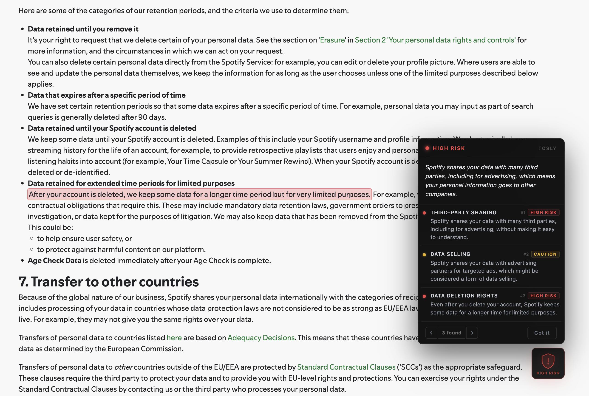
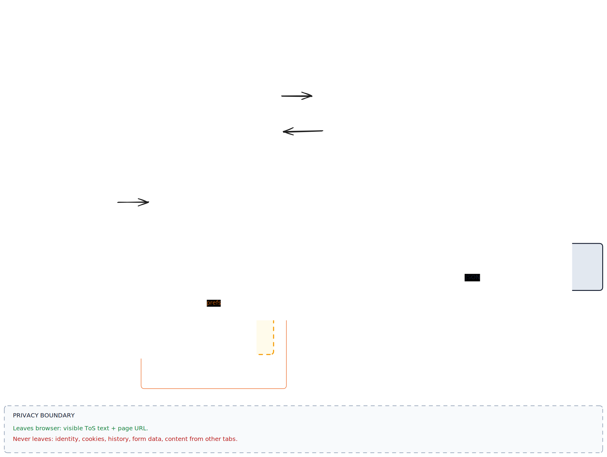

<div align="center">

  

  <h3>You clicked Accept. Without reading it.</h3>

  <p>
    <strong>Tosly reads Terms of Service pages and flags the clauses that work against you</strong><br/>
    e.g. data selling, forced arbitration, surveillance, auto-renewals - with the exact quote from the document.
  </p>

  <p>
    <a href="https://chromewebstore.google.com/detail/tosly/gnnaglpijpngbbpamicaifonnkjbicig">
      
    </a>
  </p>

  <p>
    <sub>Free forever &nbsp;·&nbsp; No account &nbsp;·&nbsp; Open source</sub>
  </p>

  <p>
    <a href="https://chromewebstore.google.com/detail/tosly/gnnaglpijpngbbpamicaifonnkjbicig">
      
    </a>
    <a href="https://chromewebstore.google.com/detail/tosly/gnnaglpijpngbbpamicaifonnkjbicig">
      
    </a>
    <a href="https://chromewebstore.google.com/detail/tosly/gnnaglpijpngbbpamicaifonnkjbicig">
      
    </a>
  </p>

  <p>
    <a href="https://youtu.be/ivAgRwcxAH4">
      
    </a>
  </p>

  <p>
    <sub><a href="#">Firefox (planned)</a> &nbsp;·&nbsp; <a href="https://github.com/preston176/tosly-chrome-extension/issues/new">Report a bug</a></sub>
  </p>

</div>

---

## Example

Open Spotify's privacy policy. Tosly flags this line:

> *"We may share your personal data with third-party advertising partners at our discretion."*

And, next to it, shows the verdict in plain English:

> [!CAUTION]
> **HIGH RISK · Data Selling**
> Your personal info is sold to advertisers. Continuing to use the service is the opt-in: there is no way to refuse.

<!-- TODO: replace with screenshot of a real flagged ToS clause -->
<p align="center">
  
</p>

Forced arbitration, auto-renewals, broad license grants. Tosly catches ~40 patterns like this.

---

## Install

| Browser | Status |
|---------|--------|
| Chrome / Edge / Brave | [Chrome Web Store](https://chromewebstore.google.com/detail/tosly/gnnaglpijpngbbpamicaifonnkjbicig) |
| Firefox | Planned |
| Safari | Not planned |

---

## Privacy & Permissions

Tosly is a privacy tool. It would be embarrassing to leak your data, so:

- **What leaves your browser:** the visible text of the ToS page you're on, plus its URL. That's it.
- **What does NOT leave:** your identity, browsing history, cookies, form data, or any other page content.
- **No account.** No login. No fingerprint.
- **Cache:** results are cached server-side per URL for 7 days. The same page is never re-analyzed for any user during that window. The cache holds analysis output, not user identifiers.

### Manifest permissions

| Permission | Why |
|------------|-----|
| `storage` | Saves your widget position and "auto-scan on/off" preference locally |
| `host_permissions: <all_urls>` | Required to read ToS text on whatever site you visit |

The full request payload is in [`backend/handlers/analyze.go`](backend/handlers/analyze.go). The full prompt sent to the LLM is in [`backend/llm/`](backend/llm/). Read the source.

---

## How it works

<!-- Diagram source: D2 (https://d2lang.com). Edit docs/diagrams/architecture.d2 then run:
     d2 docs/diagrams/architecture.d2 docs/diagrams/architecture.svg -->
<p align="center">
  
</p>

1. Content script detects ToS / Privacy pages and extracts visible text.
2. Backend prompts an LLM with a structured-output schema.
3. Extension renders the result: severity (red / yellow / green), summary, and per-flag quotes highlighted on the page.

<!-- TODO: replace with screenshot of the popup showing severity tiers + flag list -->
<p align="center">
  
</p>

The prompt is the actual product. It lives in `backend/llm/` and is the file most worth reading if you're curious how the analysis stays consistent.

---

## Repo layout

```
tosly/
├── extension/   # Chrome MV3 extension (Plasmo, React, TypeScript)
├── backend/     # Go LLM-analysis API
└── landing/     # Astro marketing site
```

| Package | Stack | What it does |
|---------|-------|--------------|
| [`extension/`](extension/) | Plasmo, React, TypeScript, Tailwind | The Chrome extension (Manifest V3) |
| [`backend/`](backend/) | Go 1.24 | Stateless analysis API with in-memory LRU cache |
| [`landing/`](landing/) | Astro, Tailwind | Marketing site |

---

## Local development

### Prerequisites
- Node 20+
- Go 1.24+
- An LLM API key (see [`backend/.env.example`](backend/.env.example))

### Backend

```bash
cd backend
cp .env.example .env  # add your API key
go run .
# → listening on :8080
```

### Extension

```bash
cd extension
pnpm install --legacy-peer-deps
pnpm run dev
```

Then load `extension/build/chrome-mv3-dev` as an unpacked extension at `chrome://extensions`. The dev build talks to `http://localhost:8080`. Production is configured via `PLASMO_PUBLIC_BACKEND_URL` at build time.

### Landing page

```bash
cd landing
npm install --legacy-peer-deps
npm run dev
# → http://localhost:4321
```

---

## API

See [`backend/README.md`](backend/README.md) for the `/analyze` request and response contract.

---

## Releasing

| Surface | Trigger |
|---------|---------|
| Backend | Push to `main` (auto-deploys via host's GitHub integration) |
| Extension | Push tag `extension-v*` (see [`extension/RELEASE.md`](extension/RELEASE.md)) |
| Landing | Push to `main` |

CI workflows live in [`.github/workflows/`](.github/workflows/).

---

## Contributing

Issues and PRs welcome. Two things to know before opening one:

1. **Bug reports need the URL.** Tosly's behavior depends entirely on the ToS text it sees. Without the page URL or the text, a bug report is unactionable.
2. **High bar for new clause categories.** Each detected category gets prompt-engineered, validated against real ToS samples, and pinned. Drive-by additions get rejected. Open an issue first if you have one in mind.

---

## What's next

- Local-only mode: a small on-device model for fully offline analysis
- Firefox port
- Diff mode: detect when a known ToS changes and re-flag

These are concrete; everything else is "maybe."

---

## Disclaimer

Tosly provides useful signal for personal decisions. **It is not legal advice.** For important contracts, consult a qualified attorney.

---

## License

TBD.
